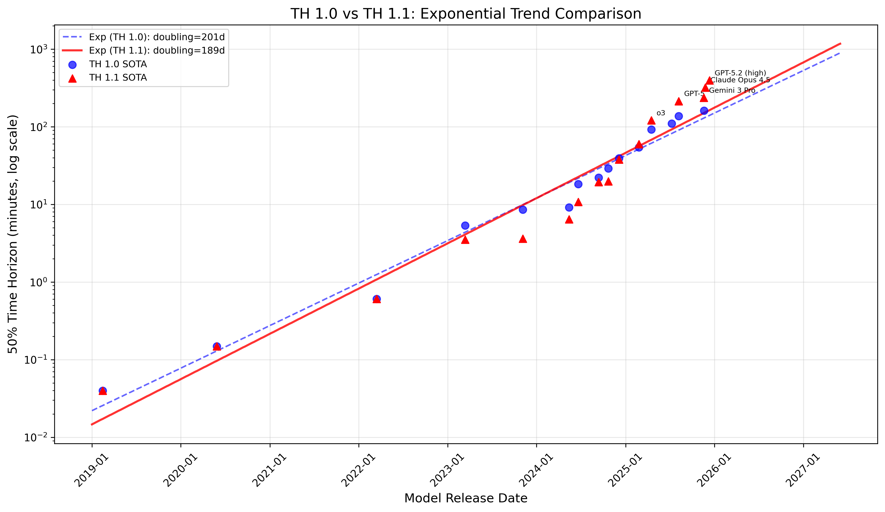
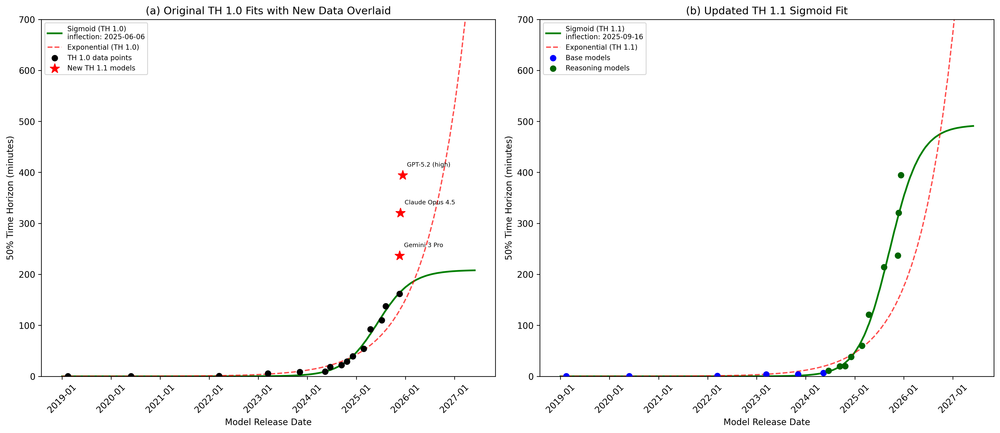
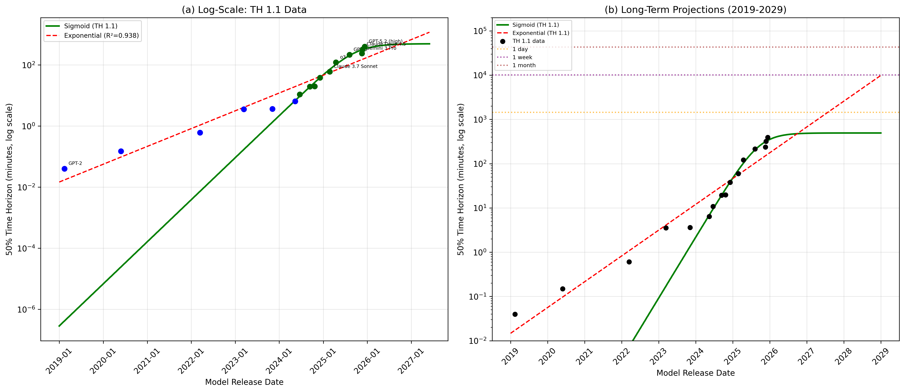

# No Sigmoids: New METR Data Challenges the Plateau Hypothesis

An addendum to [Ge, Bastani, & Bastani (2026)](https://arxiv.org/abs/2602.04836) — *"Are AI Capabilities Increasing Exponentially? A Competing Hypothesis"* — incorporating new frontier model evaluations under METR's updated Time Horizon 1.1 methodology.

## Key Findings

Three new frontier models — **Gemini 3 Pro**, **Claude Opus 4.5**, and **GPT-5.2** — were evaluated under METR's [Time Horizon 1.1](https://metr.org/blog/2025-03-19-measuring-ai-ability-to-complete-long-tasks/) methodology. The results significantly challenge the original paper's plateau hypothesis:

| Finding | TH 1.0 (Original) | TH 1.1 (Updated) |
|---|---|---|
| Sigmoid inflection point | 2025-06-06 | 2025-09-16 (+3 months) |
| Sigmoid asymptote | 3.5 hours | 8.2 hours (2.3x higher) |
| Exponential doubling time | 6.6 months | 6.2 months (all-time) / **4.2 months** (2023+) |
| Exponential R² (log scale) | 0.978 | 0.939 |

All three new models **exceed both sigmoid and exponential predictions** from the original TH 1.0 fits by 1.4–2.3x:

| Model | Actual (TH 1.1) | Sigmoid Prediction | Exponential Prediction |
|---|---|---|---|
| Gemini 3 Pro | 3.9 hrs | 2.7 hrs | 2.2 hrs |
| Claude Opus 4.5 | 5.3 hrs | 2.8 hrs | 2.2 hrs |
| GPT-5.2 (high) | 6.6 hrs | 2.8 hrs | 2.3 hrs |

GPT-5.2 achieves a 50% time horizon of ~6.6 hours — the highest ever measured by METR.

## Figures

### TH 1.0 vs TH 1.1 Comparison

Comparison of TH 1.0 and TH 1.1 SOTA data points with exponential trend lines. TH 1.1 shows a faster doubling time (189 vs 201 days) and new models extending well beyond the previous dataset.

### Sigmoid Fit Shift

Left: The original TH 1.0 sigmoid fit with new TH 1.1 data points (red stars) far exceeding the asymptote. Right: The updated sigmoid fit to TH 1.1 data, with inflection shifted to September 2025 and a much higher asymptote.

### Log-Scale Projections

Left: Log-scale view of TH 1.1 data with sigmoid and exponential fits. Right: Long-term projections showing dramatic divergence — the sigmoid predicts plateau around 8 hours while the exponential predicts month-long task horizons by 2028–2029.

## The Shifting Sigmoid Problem

The most striking finding is the instability of the sigmoid fit. With each new cohort of models, the sigmoid's asymptote is forced dramatically upward and its inflection point is pushed later. This pattern — where the "plateau" keeps receding as new data arrives — is what one would expect if the underlying process is actually exponential rather than sigmoidal. Under true sigmoid growth, new data points should fall *below* the previously estimated asymptote; instead, they consistently exceed it.

## How This Was Made

This addendum was generated entirely by **Claude Opus 4.6** (via [Claude Code](https://claude.com/claude-code)), including:

- Collecting new METR TH 1.1 data from the [METR website](https://metr.org/blog/2025-03-19-measuring-ai-ability-to-complete-long-tasks/) and [@METR_Evals on X](https://x.com/METR_Evals)
- Reproducing the original paper's sigmoid curve fitting methodology (PyTorch gradient descent with the same date convention and parameterization)
- Fitting sigmoid and exponential curves to both TH 1.0 and TH 1.1 datasets
- Generating all figures and tables
- Writing the LaTeX addendum paper

The analysis replicates the original paper's TH 1.0 sigmoid inflection point (2025-06-06) exactly, validating the methodology before extending it to TH 1.1 data.

## Files

| File | Description |
|---|---|
| [`addendum.pdf`](addendum.pdf) | Compiled addendum paper (6 pages) |
| [`addendum.tex`](addendum.tex) | LaTeX source |
| [`addendum_analysis.py`](addendum_analysis.py) | Reproducible analysis script |
| [`metr_data_notes.txt`](metr_data_notes.txt) | Raw data notes from METR sources |
| [`AI_Forecasting/data/metr_benchmark_results_v1_1.yaml`](AI_Forecasting/data/metr_benchmark_results_v1_1.yaml) | METR TH 1.1 benchmark data |
| [`AI_Forecasting/results/addendum_results.json`](AI_Forecasting/results/addendum_results.json) | Numerical results (curve fit parameters) |

## Reproducing

```bash
git clone https://github.com/obastani/AI_Forecasting.git
cp AI_Forecasting/data/metr_benchmark_results_v1_1.yaml AI_Forecasting/data/
cd AI_Forecasting
uv sync
uv run python ../addendum_analysis.py
cd ..
pdflatex addendum.tex && pdflatex addendum.tex
```

## References

- **Original paper**: Ge, Bastani, & Bastani (2026). *"Are AI Capabilities Increasing Exponentially? A Competing Hypothesis."* [arXiv:2602.04836](https://arxiv.org/abs/2602.04836)
- **Original repo**: [github.com/obastani/AI_Forecasting](https://github.com/obastani/AI_Forecasting)
- **METR Time Horizon data**: [metr.org](https://metr.org/blog/2025-03-19-measuring-ai-ability-to-complete-long-tasks/)
